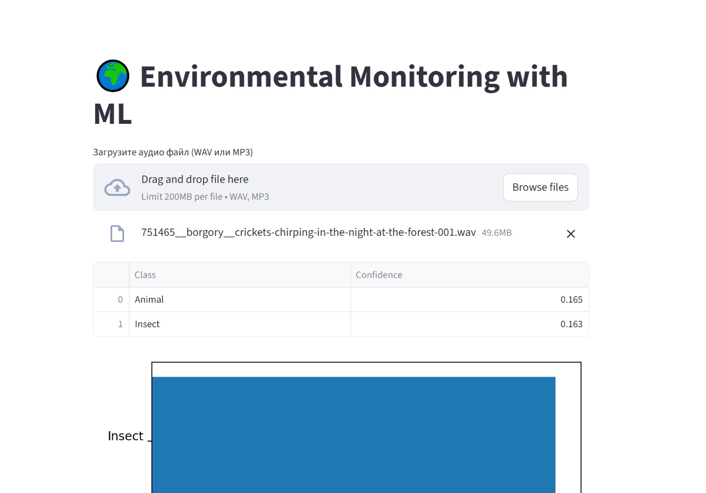

# Environmental Monitoring using Machine Learning

## Описание
Данный проект — учебный прототип системы мониторинга окружающей среды,
использующей предобученную модель машинного обучения для анализа
аудиозаписей природной среды.

Система автоматически определяет наличие животных,
природных явлений и потенциальных аномалий в экосистеме.

## Используемая модель
В проекте применяется предобученная модель YAMNet (Google),
обученная на датасете AudioSet.

## Функциональность
- анализ аудиозаписей леса
- распознавание звуков животных и окружающей среды
- визуализация активности
- автоматическое обнаружение аномалий

## Установка
```bash
pip install -r requirementx.txt
```

## Запуск приложения

Для запуска приложения выполните следующую команду в терминале:

```bash
streamlit run app.py
```

**Важно:** После запуска команды приложению требуется некоторое время для инициализации. Пожалуйста, подождите несколько секунд (10-15) перед тем, как интерфейс полностью отобразится в браузере. Это время необходимо для загрузки модели машинного обучения и подготовки всех компонентов системы.

После успешного запуска приложение автоматически откроется в браузере по адресу `http://localhost:8501`.

## Интерфейс приложения



Приложение предоставляет простой и интуитивно понятный интерфейс для загрузки и анализа аудиофайлов. После загрузки файла система автоматически выполняет анализ с помощью ML-модели и отображает результаты.

